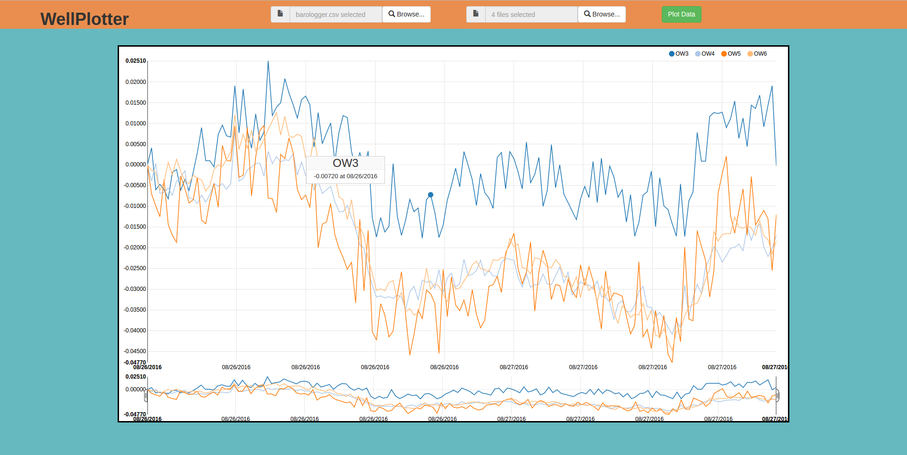

# WellPlotter
An application for plotting monitor well data files from Solinst Leveloggers

WellPlotter is an application built with Node.js, express, python, bootstrap, html5, and d3. WellPlotter enables users to take raw csv files from Solinst Leveloggers and quickly plot the data to analyze.

Leveloggers are a piece of environmental engineering equipment that precisely track the water head in monitor wells over extended periods of time. This data is useful in two types of environmental tests: Aquifer pump tests and slug tests. WellPlotter is most useful for the first of these. Aquifer pump tests are conducted to ensure that an aquifer is not significantly depleted by pumping from it. Pump tests can last from a few days to a few weeks. During this period water is periodically pumped from the aquifer at a high rate, then the aquifer is allowed to recover. By plotting the data from a pump test it makes it visually apparent whether or not an aquifer is fully recovering or if it is being overly depleted from pumping. WellPlotter makes this fast and easy.

To use WellPlotter users must first upload a set of data from a barometric pressure logger as well as one or more monitor well data files.

To create the graphs, WellPlotter first barometrically corrects each well data file using the data points from the barometer. It matches data points based on date and time so that the barometric correction is input resilient. Next it reduces the number of data points by a factor of 5 (there is typically too much data to produce a clear graph). While reducing the number of points, WellPlotter also changes the "Level" reading from the leveloggers to a net change reading to show the fluctuations in water levels in each monitor well. Once the final data file has been prepared d3 is used to plot the resulting datasets from the input monitor wells. 

If you have any questions, comments, contributions, or concerns please let us know by submitting an issue, a pull request, or by sending a message.
